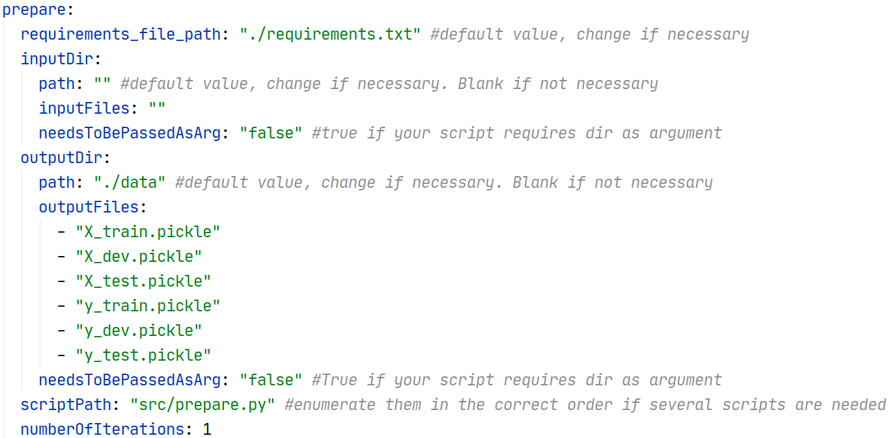
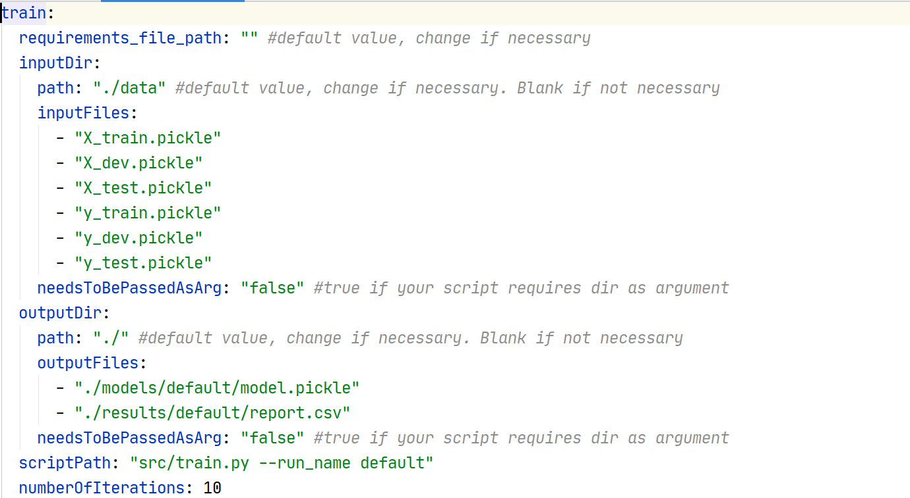
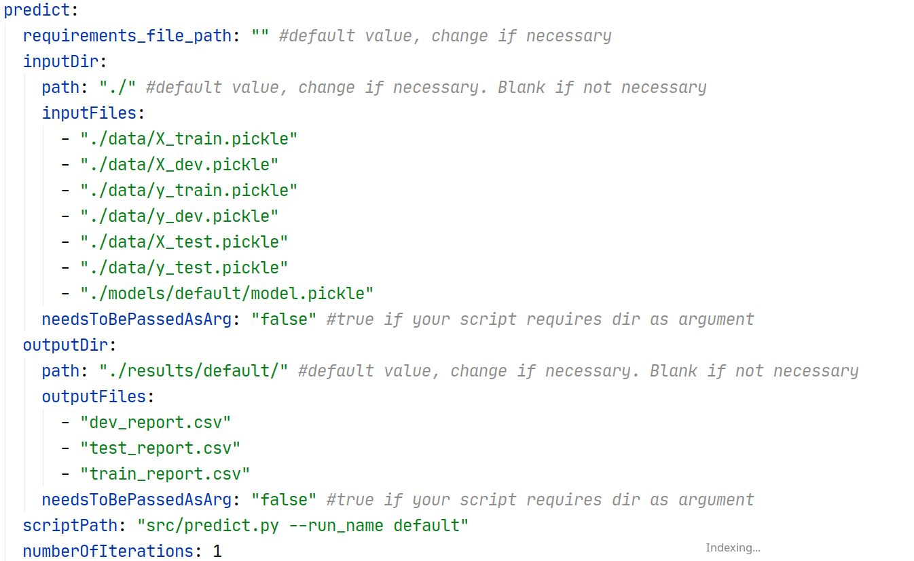

# Образец файла README для репозитория эксперимента

## Об этом примере

Данный пример поможет разобраться, как работает mldev.

В примере решается несложная задача классификации на датасете [iris](https://scikit-learn.org/stable/auto_examples/datasets/plot_iris_dataset.html).
Для решения используется библиотека [scikit-learn](https://scikit-learn.org) и библиотека [pandas](https://pandas.pydata.org)

Задача классификации ставится следующим образом. 
Задан набор данных с числовыми признаками $`X_{ij}`$ и номерами классов $`y_i`$.
Нужно научить модель $`f_t(X)`$ предсказывать номер класса по значениям признаков. 

```math
L(f_t(X), y) \to \min_t
```  

В данном примере данная задача классификации решается с помощью онлайн алгоритма градиентного 
спуска [SGDClassifier](https://scikit-learn.org/stable/modules/generated/sklearn.linear_model.SGDClassifier.html).
Используется так называемая [hinge loss](https://en.wikipedia.org/wiki/Hinge_loss) 
функция ошибки $`L = max(0, 1 - y^T f_t(X))`$. 

В процессе обучения модели, алгоритм обновляет параметры модели $`t`$ в направлении, 
обратном градиенту ошибки $`\partial L / \partial t`$ так, 
чтобы после нескольких обновлений значение функции ошибки уменьшалось. 
Процесс останавливается после выполнения определенного числа обновлений или когда значение ошибки перестает меняться достаточно сильно. 
 
## Описание эксперимента

В эксперименте на этапе ``prepare`` мы получаем данные из библиотеки ``sklearn``, 
разделяем случайным образом на ``test``, ``dev`` и ``train`` части, и сохраняем их под версионным 
контролем в папке ``./data``, вызывая скрипт ``./src/prepare.py``.

Далее на этапе ``train`` мы обучаем нашу модель на ``train`` части данных и сохраняем модель в папке ``./models``.

Обучив модель, мы можем получить предсказания на ``test`` данных, вызывав скрипт ``predict.py``.

В процессе выполнения эксперимента в папке ``./logs/`` собираются логи обучения, из которых можно понять, 
как меняется качество модели на ``dev`` части данных. 
Скрипт обучения также записывает текущие значения функции ошибки в ``tensorboard`` для динамического наблюдения за экспериментом.  

См. также [наблюдение за экспериментом](#наблюдение-за-экспериментом)

## Установка и повторение эксперимента

### Исходный код

Код подготовки данных находится в ``src/prepare.py``. 
Скрипт загружает набор данных ``iris`` и разделяет на ``train``, ``dev``, ``test``.

Код обучения модели находится в ``src/train.py``.

Код получения предсказаний и оценивания модели находится в ``src/predict.py``.

### Повторение эксперимента

Порядок проведения эксперимента записан в файле ``experiment.yml``, обрабатываемом ``mldev`` при запуске.
В файле эксперимента записаны этапы его проведения и параметры, с которыми вызывается код эксперимента:

Для повторения эксперимента необходимо [установить](https://gitlab.com/mlrep/mldev/-/blob/develop/README.md) ``mldev``, 
перейти в папку с экспериментом и выполнить 
```
# Готовим и настраиваем эксперимент
$ mldev init -r .

# Выполняем эксперимент
$ mldev run 
```

В файле ``experiment.yml`` приведено описание эксперимента и его настройки.

1. Этап подготовки данных



2. Этап обучения модели



3. Этап оценки модели



## Наблюдение за экспериментом

``mldev`` помогает сохранять промежуточные результаты обучения и отслеживать ход обучения, даже если вычисления производятся в облаке.

### Наблюдение через Tensorboard

В файле ``experiment.yml`` настроено наблюдение за ходом эксперимента в ``tensorboard``. 
Если проводите эксперимент в облаке (например, colab), проверьте, что указан токен для сервиса ``ngrok``. 
Через него можете подключиться к ``tensorboard``, URL подключения можно узнать командой ``mldev urls`` (пока не реализовано)

## Лицензия и использование примера

Пример распространяется под лицензией Apache License 2.0. 
См. также [NOTICE](https://gitlab.com/mlrep/mldev/-/blob/develop/NOTICE.md)

